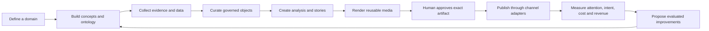
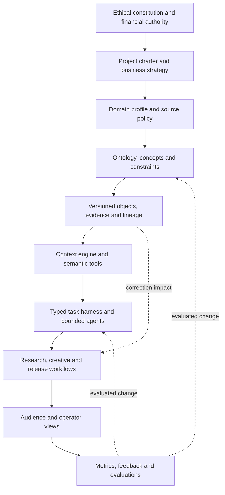

<div align="center">

# BS CATS

### Governed domain intelligence that turns trustworthy data into reusable commercial assets

**Evidence over hype. Human effort only where judgment matters. Revenue only within legal, ethical and financial boundaries.**

[](https://github.com/smaranneducations/bs-cats-smartglasses-20260912/actions/workflows/ci.yml)
[](https://github.com/smaranneducations/bs-cats-smartglasses-20260912/releases)


[Vision](#the-idea) | [Economics](#economics) | [Architecture](#cognitive-architecture) | [Roles](#people-and-authority) | [Workflow](#one-guided-operating-loop) | [Status](#current-release-reality)

</div>

---

## Current release reality

| Surface | State | Where |
|---|---|---|
| Repository release candidate | Frozen | [`v1.0.0-rc.1`](https://github.com/smaranneducations/bs-cats-smartglasses-20260912/releases/tag/v1.0.0-rc.1) |
| Monthly recovery snapshot | Frozen | [`snapshot-2026-09`](https://github.com/smaranneducations/bs-cats-smartglasses-20260912/releases/tag/snapshot-2026-09) |
| Local audience, intelligence and operator experience | Working candidate | Run locally using the instructions below |
| Firebase production application | **Not live** | The intended host currently returns HTTP 404 |
| Production deployment work | Open | [Issue #3](https://github.com/smaranneducations/bs-cats-smartglasses-20260912/issues/3) |

There is deliberately no production link presented as working. A verified Firebase URL will be added only after the same immutable artifact passes `preprod`, UAT and production admission, and a deployment receipt proves that the public application and durable backend work together.

The repository is a substantial governed foundation, not proof of revenue, audience demand, complete integrations or production readiness. See the [validation report](docs/V1_VALIDATION_REPORT_2026-09-13.md) and [machine-readable readiness report](docs/V1_RELEASE_READINESS_REPORT.json).

---

## The idea

Most AI tools create another answer, document or media file. BS CATS is designed to create something more durable: a **maintained intelligence asset around a domain**.

A solo operator defines a useful domain. Governed agents research it, propose its ontology, collect legally usable evidence, structure comparable data, create analysis and media, publish approved outputs and learn from measured results. Human attention is reserved for consequential ambiguity, corrections, strategy and exact publication approval.

Smart glasses are the current prototype domain. The reusable product is the engine underneath it:



The loop becomes cheaper and more useful as evidence, definitions, media, decisions, templates and evaluation cases are retained and reused. It is not allowed to become uncontrolled, self-authorizing or self-spending.

## Why smart glasses first

Smart glasses are a working business hypothesis rather than a permanent platform dependency.

| Fit signal | Why it matters |
|---|---|
| International online audience | Editorial value can be delivered globally without a local service business |
| Products are often purchased online | Content can connect to measurable online intent and disclosed commercial offers |
| Manageable but changing catalogue | A solo operator can develop depth without maintaining millions of records |
| Rich comparison questions | Display, compatibility, prescription support, privacy, comfort, subscription and ecosystem concepts produce useful analysis |
| Visual and evolving category | Product cards, comparisons, Shorts, news and change reports can reuse governed knowledge |
| Incomplete public understanding | Explicit unknowns, variant control and evidence lineage can add value beyond copied specification tables |

The domain remains subject to a data-fit gate. It should be replaced if another online, internationally accessible domain demonstrates better lawful data access, buyer value, maintenance cost and realistic revenue paths.

---

## Who this serves

| Audience | Need | Value proposition |
|---|---|---|
| Product readers and buyers | Understand products, features, trade-offs and changes quickly | Useful visual decisions without reading dozens of inconsistent pages |
| Solo domain operators | Convert specialist knowledge into a maintained asset without a large team | Human judgment joined to a reusable operating system with minimal repetitive work |
| Researchers and data customers | Buy reliable exports, reports, comparisons or API access | Versioned intelligence with definitions, provenance and explicit uncertainty |
| Creators and commercial customers | Generate evidence-bound short-form content | Existing ontology, claims, media rights, templates and QA reduce effort and risk |
| Sponsors, merchants and partners | Reach a relevant audience transparently | Disclosed commercial access without purchasing factual rankings |

The audience experience is intentionally closer to a swipeable visual publication than an enterprise dashboard. The operator experience exposes the intelligence underneath it.

---

## Economics

### Objective

The operating objective is to maximize **sustainable contribution**, not views, output volume or gross revenue.

```text
contribution
+= collected revenue
- model and API usage
- hosting, storage and delivery
- media and rendering costs
- payment fees and refunds
- attributable subscriptions and tools
- valued human operating time
```

Revenue is optimized only after legality, safety, dignity, privacy, consent, intellectual-property rights, truthfulness, platform rules and ethical acceptability pass. A profitable but non-compliant action is rejected.

### Seed experiment

| Control | Policy |
|---|---|
| Cumulative seed ceiling | USD 500 across subscriptions, APIs, infrastructure and other project costs |
| Owner-reported starting subscription | USD 80 paid on 2026-09-12 |
| Remaining theoretical room | At most USD 420 before other incurred, delayed or committed costs |
| Review points | USD 150, USD 250 and USD 350 total exposure |
| New paid-work stop | USD 450, preserving USD 50 for delayed or fixed charges |
| Initial variable-cost task limit | USD 2 |
| Initial daily variable-cost limit | USD 5 |

These are ceilings, not budgets to exhaust. Unknown prices or stale accounting deny new paid execution. Provider alerts help but do not guarantee a hard cap.

### Revenue portfolio

| Channel | Offer | Evidence needed before scaling |
|---|---|---|
| Owned publication | Useful visual product intelligence, sponsorship and on-site advertising | Returning audience, retention, qualified intent and net contribution |
| YouTube | Original Shorts, channel advertising and disclosed commercial links | Approved access, retention, returning viewers and revenue receipts |
| LinkedIn | Category analysis, professional reach and disclosed partnerships | Relevant engagement, qualified inquiries and compliant automation |
| Other social channels | Platform-specific posting kits pointing toward owned media | Attributable traffic without spam, fake personas or bought reach |
| Affiliate relationships | Disclosed links to eligible merchants | Active approval, tracked conversion, returns and collected commission |
| Sponsorship | Clearly labeled placements and reports | Audience fit, disclosure, contract terms and editorial independence |
| Reports and exports | Maintained analysis or data packages | Lawful reuse rights, buyer interviews and paid demand |
| Governed API | Metered approved knowledge and comparisons | Stable schema, support cost, access controls and willingness to pay |
| Customer-funded video generation | Customer funds model tokens and media; platform supplies ontology, evidence, workflow and QA | Full cost measurement, customer consent, quality acceptance and positive margin |
| Training and education | Teach ethical AI-assisted data-asset operations | Demonstrated workflow, learning outcomes and honest positioning |
| Licensed operating system | Configure the reusable engine for another narrow domain | Portability evidence and sustainable support economics |

The preliminary customer-funded generation hypothesis targets a 30 percent gross platform margin only after model, rendering, storage, support, payment and failure costs are measured. Customer keys must not be casually retained; provider-supported delegated billing or scoped, revocable credentials are preferred.

No channel is validated merely because an API exists or a merchant accepts online checkout. Eligibility, attribution, payment, returns, rights, conversion and collected revenue are separate states.

---

## People and authority

| Persona | Purpose | May do | May not do alone |
|---|---|---|---|
| Platform custodian | Maintains laptop, repository, cloud accounts and browser-only consent | Install tools, maintain GitHub, complete account-holder flows, recover infrastructure | Transfer legal or financial accountability to an agent |
| Agent operating manager | Leads strategy and routine execution within delegated policy | Research, plan, implement, monitor and execute reversible permitted work | Own accounts, approve expanded authority, overspend or publish unseen artifacts |
| Business administrator | Teaches the system and governs domain quality | Review ontology, correct data, answer genuine exceptions and approve exact releases | Perform every routine review or relabel opinion as verified fact |
| Audience or customer | Consumes and reacts to useful outputs | Swipe, watch, compare, react, comment and use available offers | Access administration or directly rewrite governed truth |

The operating agent acts like an accountable general manager, not a legal owner. Accounts, liabilities, earnings, financial authority and legal responsibility remain human-held.

### Authentication and attribution

- Firebase Authentication with Google is the intended identity provider.
- Administrator access requires both Google authentication and membership in the configured admin allowlist.
- Audience authentication may remain optional for browsing and become required for durable reactions, comments or paid services.
- Service access uses scoped workload identity rather than downloaded permanent account keys.
- Every important write records actor, timestamp, input version, policy version and affected object.
- Publisher credentials belong only to publishing adapters; research and rendering workers do not receive them.

---

## Cognitive architecture

The platform treats intelligence as a governed stack, not a single large prompt.



### Context hierarchy

Agents receive the smallest relevant context slice in this order:

1. Constitutional constraints and authority boundaries.
2. Current project charter and financial policy.
3. Active domain, audience and business objective.
4. Workflow contract, acceptance criteria and permissions.
5. Relevant ontology concepts and definitions.
6. Current object versions, evidence and prior decisions.
7. Task-local inputs, tools, budget and idempotency key.

The platform stores inspectable decisions, evidence, rules, summaries, evaluation cases and outcomes. It does not preserve hidden chain-of-thought as organizational memory.

### Recursive but bounded agents

The harness can decompose a goal into smaller typed tasks using the same contract recursively. Recursion is structural, not permission escalation.

Every task carries objective, acceptance criteria, policy versions, actor, evidence versions, allowed tools, write scope, budgets, retry limits, idempotency, output schema, review requirement and rollback path.

A child task receives no broader data, permission or budget than its parent. The default is one agent; extra specialists are justified only when work is independent and materially improves the result.

The versioned roster can include research, source-policy, ontology, curation, comparison, editorial, script, visual-direction, media-catalog, rendering, marketing, release, publishing, analytics and model-routing roles. These are roles over shared contracts, not an expensive permanent council.

### Self-growing without self-governing

```text
feedback -> classification -> proposal -> impact analysis -> evaluation
         -> authorized promotion -> monitored result -> retain or roll back
```

The system can apply reversible routine corrections inside policy. It cannot silently expand permissions, raise budgets, weaken evidence or rights gates, approve public output, change constitutional priorities or create uncontrolled paid work.

Every substantive feedback item becomes an applied correction, scoped preference, reusable rule, ontology proposal, evaluation case, bounded experiment, or justified deferred/no-change decision.

---

## Ontology and semantic design

The ontology is the reusable intelligence backbone. It defines what data means before agents or interfaces decide how to use it.

It contains concepts and relationships; field definitions, types, units and allowed values; product, variant, region and market identity; source and evidence classes; uncertainty and comparison semantics; and business, creative, workflow and policy concepts.

The standards profile aligns with W3C SKOS, SHACL, PROV-O, DCAT, ODRL and JSON-LD. The runtime remains deliberately lightweight until a graph-specific workload justifies another database.

### Enriched forms

Forms are generated from ontology and object metadata instead of being hand-built for every field.

| Form context | Example |
|---|---|
| Human label | Subscription required |
| Definition | What counts as a mandatory recurring payment |
| Value type | Boolean, amount, category, text, date or relationship |
| Unit and regime | USD/month, grams, degrees, market or test method |
| Why it matters | Purchase cost, compatibility or task impact |
| Evidence expected | Official terms, documentation or independent test |
| Confidence | Known, uncertain, disputed or unknown, with reason |
| Provenance | Source, observation date, extractor and object version |
| Policy | Who can edit, approve, publish or retire it |

An administrator can add a missing concept once and let it propagate into capture, comparison, analysis and presentation without requesting a custom screen.

---

## Data architecture: simple on purpose

BS CATS does **not** use BigQuery as a transactional graph database. Each store has one job.

| Layer | Technology | Responsibility |
|---|---|---|
| Identity and authorization | Firebase Authentication | Google login, administrator allowlist and attributable actions |
| Transactional governed objects | Firestore | Current object, history, version checks and idempotency receipts |
| Analytical warehouse | BigQuery | Typed projections, comparisons, trends, metrics and reporting |
| Media and release artifacts | Cloud Storage / owned storage | Source assets, renders, manifests, hashes and retained outputs |
| Public and operator delivery | Firebase Hosting plus Cloud Run | Global web delivery and a scale-to-zero API |
| Source and release control | GitHub | Issues, branches, PRs, CI, snapshots, environments and rollback |

### Why BigQuery

- It handles analytical scans, comparison matrices, trends and aggregations well.
- Typed tables make units, variants, dates and provenance queryable.
- Partitioning, clustering, dry runs and maximum-byte limits support bounded cost.
- It supports reporting and future governed exports without operating a database server.
- Existing GCP and Firebase use reduces vendors and operational burden.

### Why not a graph database now

- The first domain has not demonstrated traversal volume that justifies another service.
- A graph database adds deployment, backup, security, migration and cost responsibilities.
- Versioned JSON objects with explicit relationships preserve semantic portability.
- JSON-LD-ready identities leave a future graph path open.
- RDFLib or pySHACL can be added after a bounded proof demonstrates practical value.

Firestore protects operational truth. BigQuery provides analytical projections. A warehouse row cannot silently overwrite a canonical object, and an analysis pins the object, definition and evidence versions it used.

---

## Governed objects

Every meaningful entity becomes an inspectable, versioned object: concepts, definitions, products, variants, sources, assertions, comparisons, reports, prompts, agents, workflows, forms, feedback, media, videos, offers, receipts, metrics, policies, decisions, exceptions and evaluation cases.

An object records purpose, context, payload, evidence and lineage, version and history, actor and access, review state, applicable policy and dependent outputs. If a fact changes, the impact graph identifies comparisons, stories, videos and offers that require revalidation.

Unknown is a valid value. Manufacturer-stated specifications are not presented as hands-on testing. Opinion, observation, analysis and verified assertion remain distinct.

---

## One guided operating loop

1. **Define domain:** describe the domain, audience, buyer problem and source boundaries.
2. **Shape ontology:** review concepts, definitions, units, relationships and missing questions.
3. **Grow dataset:** search, filter, create, edit, retire and inspect records and evidence.
4. **Resolve exceptions:** answer only genuine uncertainty, conflict, rights, cost or consequential questions.
5. **Direct creativity:** inspect agents, creative primitives, themes and instructions.
6. **Review outputs:** see the exact video, claims, rights, title, description, tags and disclosure together.
7. **Approve and distribute:** approve one immutable package; unavailable adapters create posting kits.
8. **Learn and improve:** examine feedback, performance, cost and proposed changes by category.

Routine high-confidence ingestion should not flood the administrator with approvals. Human review is reserved for meaningful questions and consequential publication.

The public experience is simpler: swipe through product stories, feature impacts, comparisons, changes and videos; then react, comment, explore evidence or follow a relevant offer. One product can create many useful stories because attributes are bundled around user tasks rather than dumped into one poster.

---

## Creative and distribution system

The canonical format is one energetic, rights-governed, 9:16 video lasting 30 to 90 seconds.

- Kinetic text rather than mechanical narration.
- Background music with verified usage rights.
- Realistic, colorful authorized imagery where available.
- Clearly labeled generated illustration only when it does not imply an unverified product appearance.
- One useful idea per story: a feature impact, comparison, use case, change or category insight.
- Exact claims bound to current evidence and object versions.
- One approved master supporting owned media, YouTube, LinkedIn and channel-specific posting kits.

The media agent searches the catalog first. Every asset records identity, source, license, attribution, use, restrictions, hash and prior usage. Generation is a fallback capped at USD 0.10 per image, and generated assets enter the catalog for reuse.

Owned storage remains canonical so the business does not lose its library if a social platform removes an account. Publishing requires independent source-policy, factual, media-rights, render-QA, cost and exact-artifact approval gates.

---

## Technology

| Area | Current choice | Design reason |
|---|---|---|
| API contracts | Python and Pydantic | Typed boundaries and deterministic validation |
| API target | Cloud Run | Scale to zero and low administration |
| Web applications | Lightweight HTML, CSS and JavaScript | Fast delivery and inspectable behavior |
| Operational data | Firestore target | Serverless transactions and object history |
| Analytics | BigQuery | Bounded analytical queries and semantic projections |
| Authentication | Firebase Auth with Google | Familiar consent and attributable writes |
| Hosting | Firebase Hosting target | Global delivery and controlled API rewrites |
| Media | Pillow and FFmpeg | Reproducible local rendering before paid generation |
| Source control | GitHub | Change management, CI, releases and rollback |
| Model routing | Versioned routing policy | Least expensive model meeting measured quality |
| Interoperability | JSON and JSON-LD-ready identities | Portable objects without premature infrastructure |

Deterministic code handles parsing, validation, arithmetic, rendering, encoding, deduplication and quota accounting whenever possible. Models are used where judgment adds value.

---

## Safety and trust

The [ethical operating constitution](governance/ETHICAL_OPERATING_CONSTITUTION.md) is evaluated before financial optimization.

The system denies illegal actions, fabricated claims or metrics, rights-unclear media, privacy or consent violations, exploitative behavior, hidden commercial influence, credential bypass, unauthorized spending and public publishing without exact-artifact approval.

Safety, system security, data protection and privacy share the same constitutional tier as legality and ethical conduct. No revenue objective, mode, role, urgent request or convenience can override them.

Credentials stay outside Git. `.env` and local operating state are ignored, and exact staged material is checked by both the credential scanner and repository publication guard. Personal or restricted data, internal access details and exploitable vulnerability information are excluded from public changes. Security findings use GitHub private vulnerability reporting with minimum necessary disclosure. Credentials previously shared in conversation must be treated as exposed and rotated before production use. See [SECURITY.md](SECURITY.md).

---

## GitHub-controlled delivery

```text
issue or change request
  -> codex branch
  -> pull request
  -> CI and review disposition
  -> protected main
  -> immutable snapshot
  -> preprod
  -> UAT
  -> live production
```

Only production is live. Preprod and UAT are immutable snapshots and validation records. The same commit digest moves through every stage.

- Daily rollback artifacts are retained for five days.
- At least one monthly snapshot release is retained indefinitely.
- Production versions use semantic versioning, release notes and a rollback target.
- Direct cloud-console changes are break-glass only and must be reconciled through GitHub.

Read the [change and release constitution](docs/CHANGE_AND_RELEASE_CONSTITUTION.md) and [contribution guide](CONTRIBUTING.md).

---

## Replicate this project safely

The shortest responsible replication path is:

1. Download or clone the complete GitHub repository.
2. Open that checkout in Codex, Cursor or another capable coding agent.
3. Give the agent this README and `AGENTS.md` as the entry instructions.
4. Ask it to inspect the downloaded repository, preserve its architecture and create a fresh deployment for your chosen domain.
5. Create your own Firebase/GCP projects, GitHub repository, administrator allowlist and provider applications.
6. Supply credentials only through ignored local configuration, provider consent or workload identity. Never copy credentials, private data or cloud identifiers from this deployment.
7. Run the repository tests and publication guards, then use the same issue, PR, snapshot, preprod, UAT and production promotion path.

Suggested agent request:

```text
Use README.md and AGENTS.md as the governing entry points. Inspect this complete
repository and replicate the BS CATS platform for my selected domain. Preserve
the constitutional security, privacy, evidence, spending and publication gates.
Create fresh cloud resources and local-only credentials; do not reuse or expose
the original operator's data, secrets or account identifiers. Work through
GitHub issues, branches, pull requests, CI, preprod, UAT and production. Report
implemented, partial and blocked capabilities truthfully.
```

The README explains intent, but the complete repository supplies the contracts, tests, workflows and deeper decisions needed for a faithful build. See [safe replication](docs/SAFE_REPLICATION.md) for the minimal boundary checklist.

---

## Run the current local candidate

```bash
.venv/bin/python scripts/serve_scoped_workspace.py
```

| Experience | Local URL |
|---|---|
| Audience publication | `http://127.0.0.1:8766/discover?preview=1` |
| Solo operator | `http://127.0.0.1:8766/operator` |
| Intelligence workspace | `http://127.0.0.1:8766/intelligence` |
| Architecture guide | `http://127.0.0.1:8766/operator/docs/platform-architecture.html` |

The scoped server creates temporary local credentials and grants no cloud identity. Local success is not a production receipt.

### Validate

```bash
.venv/bin/python -m unittest discover -s tests -p 'test_*.py' -q
.venv/bin/python scripts/secret_scan.py --mode worktree
.venv/bin/python scripts/audit_requirements.py
.venv/bin/python scripts/release_readiness.py
```

The current baseline is 187 passing tests. One non-failing fixture warning is documented in the validation report.

---

## Repository map

| Path | Responsibility |
|---|---|
| `apps/public` | Swipeable audience experience |
| `apps/operator` | Guided operator workflow and admin authentication |
| `apps/web` | Intelligence, object and production review surfaces |
| `packages/contracts` | Versioned schemas and invariants |
| `packages/domain_engine` | Domain configuration and portability |
| `packages/knowledge` | Semantic projection, BigQuery and comparisons |
| `packages/agents` | Inspectable role registry |
| `packages/runtime` | Tasks, tools, ledger and execution harness |
| `packages/intelligence` | Feedback, market and source intelligence |
| `packages/media` | Catalog, planning, rendering and release review |
| `packages/publishing` | Exact-package distribution control |
| `packages/analytics` | Metrics and contribution measurement |
| `services/api` | Unified API and application delivery |
| `config` | Versioned non-secret operating policy |
| `governance` | Authority and constitutional rules |
| `docs` | Architecture, runbooks and decisions |
| `.github` | Requests, PRs, CI, snapshots and promotion |

---

## Read deeper

| Topic | Document |
|---|---|
| Complete v1 system | [V1 system specification](docs/V1_SYSTEM_SPECIFICATION.md) |
| Visual architecture | [Architecture map](docs/architecture/platform-overview.html) |
| Ontology | [Ontology architecture](docs/ONTOLOGY_ARCHITECTURE.md) |
| Economics | [Business model and measurement](docs/BUSINESS_MODEL_AND_MEASUREMENT.md) |
| Autonomous delivery | [Autonomous delivery plan](docs/AUTONOMOUS_DELIVERY_PLAN.md) |
| Engineering quality | [Completion standard](docs/ENGINEERING_COMPLETION_STANDARD.md) |
| Canonical content | [Content and distribution](docs/CANONICAL_CONTENT_DISTRIBUTION.md) |
| Media rights | [Media catalog and generation](docs/MEDIA_CATALOG_AND_GENERATION.md) |
| Release truth | [Release readiness](docs/V1_RELEASE_READINESS.md) |

---

## What success means

Success is not the number of agents, prompts, tables, videos or views. The first experiment succeeds when it demonstrates a lawful maintainable evidence base, accepted outputs, a complete feedback loop, falling cost and human effort, returning attention, qualified intent, collected revenue with positive contribution, reusable primitives and safe recovery.

Revenue is possible, not promised. The system earns the right to scale through measured usefulness, trust and positive contribution.

## License status

No repository-wide open-source license has been selected. Public visibility does not grant permission to copy, modify or redistribute the software. Third-party fonts and media retain their recorded licenses and attribution requirements.

---

<div align="center">

### Build intelligence once. Reuse it carefully. Earn only after trust.

</div>
